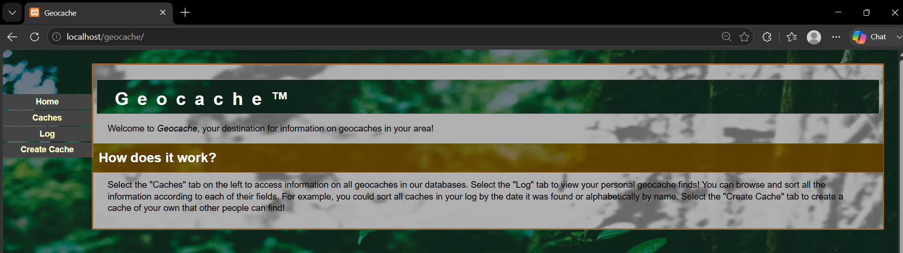
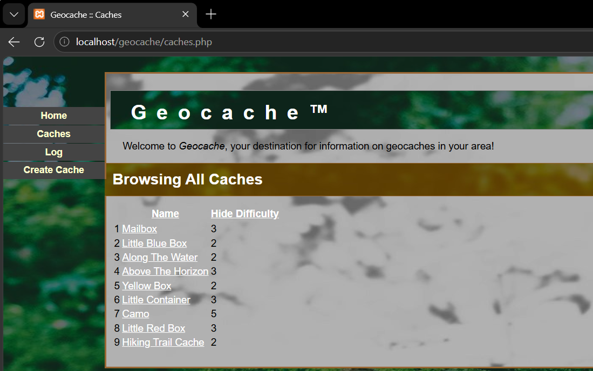
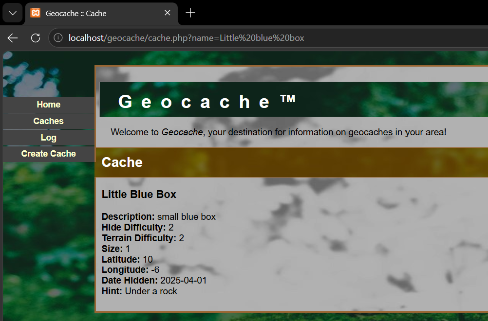
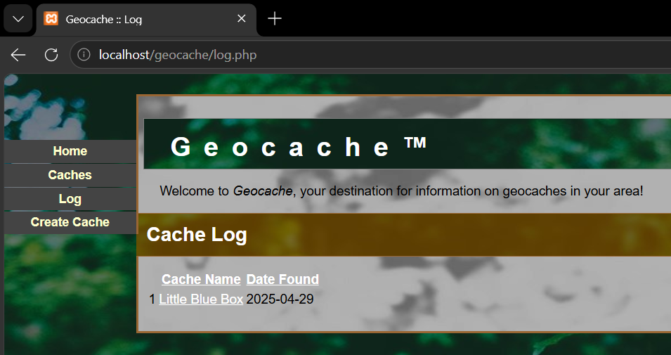
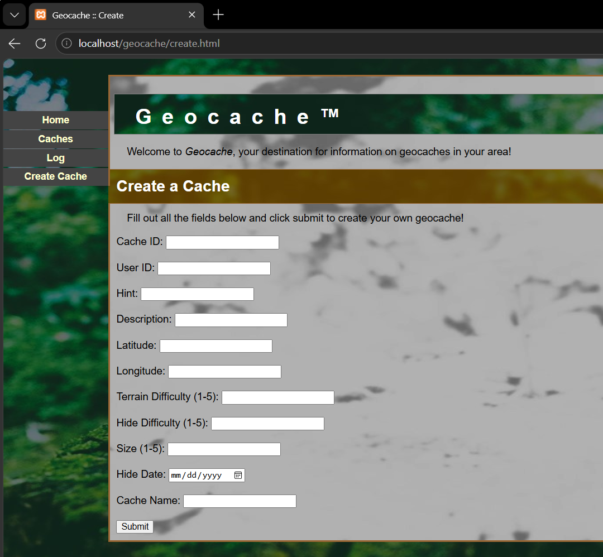

# Geocaching Web Portal 🔍

Web portal allowing the querying of geocaches, replicating the geocaching mobile app.

## What is Geocaching?

Geocaching is a global activity where people from around the world hide "caches" in a location of their choosing and provide users with a hint to its whereabouts. These caches can be of any size, color, or form.
Now for the fun part, anyone can then try to test their scavenger hunting skills and go find these caches! Anyone can be a cache hider or hunter, as long as you are up for the challenge!

### Local Web Server & Database

Used XAMPP with Apache to host and run the website locally, and MySQL to manage and store the application's database.

### Home Page

### Geocache List Page

Key Features:
- Cache list that can be sorted by the **Cache Name** or **Hide Difficulty** by selecting column label
- Selecting the name of a cache redirects to a details page about the cache

### Geocache Details Page

Key Features:
- Lists title of the cache
- Lists key details about the cache (hide difficulty, size, etc) queried from SQL database

### Geocache Log Page

Used to keep track of caches the user has found.

Key Features:
- Cache list that can be sorted by the **Cache Name** or **Date Found** by selecting column label
- Selecting the name of a cache redirects to a details page about the cache

### Create a Cache Page

Key Features:
- Text fields for users to enter details about the cache they have created
- **Submit** button to enter the cache into the MySQL database
- Once the new cache is submitted, it is viewable on the **Geocache List Page**

